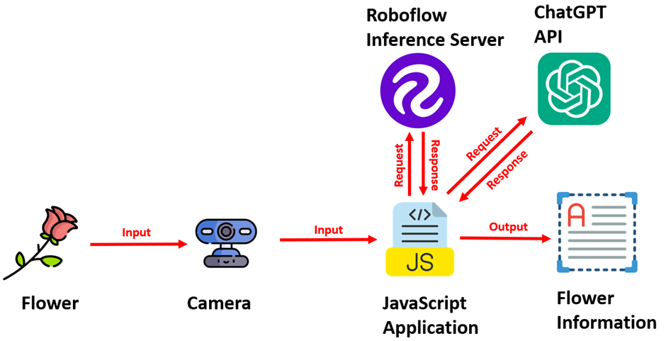

# flower-app-genai
This project detects flower using computer vision model and provide botanical information about detected flower.   
  

<h3>Steps to Run:</h3> 
<ol>
  <li>Copy all files in Web Server Directory</li>
  <li>Specify ROBOFLOW API and CHATGPT API in <code>main.js</code></li>
  <li>Run <code>index.html</code> in Web Browser</li>
</ol>
  
<h3>Final Output</h3>
 
 
